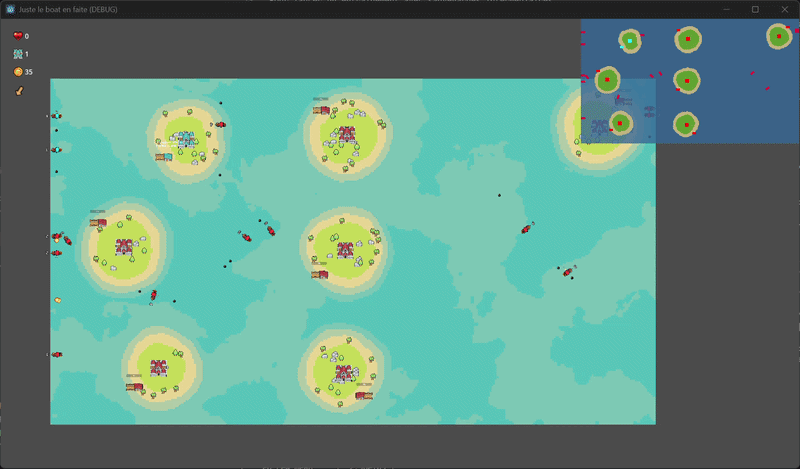
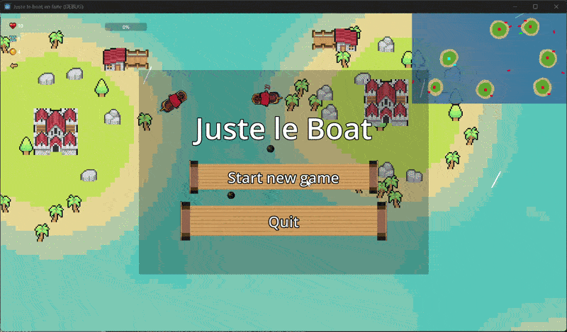

# THIS IS THE BOAT 

!!!! Le projet fonctionne avec GODOT 4.6.+ en DOTNET (sinon pas d'IA)

Les instrcutions pour entrainer le modèle avec python se trouuvent ici : [python/pythonReadme.md](python/pythonReadme.md)

### preview du projet :
à noter : La qualité des extraits eset un petit douteuse. 
#### example d'entrainement (premières itérations): 

#### Footage ingame : 

- merci de ne pas juger les compétences du joueur.